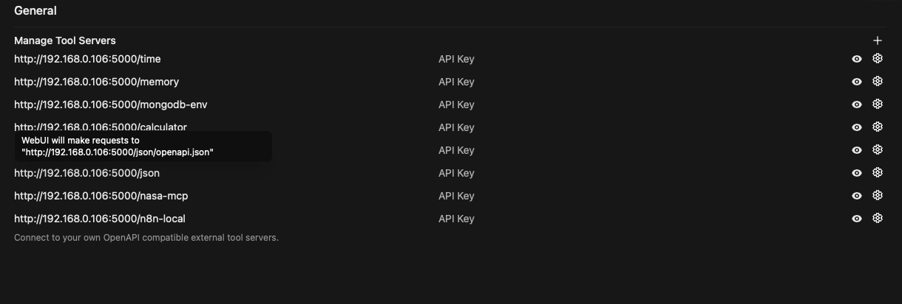
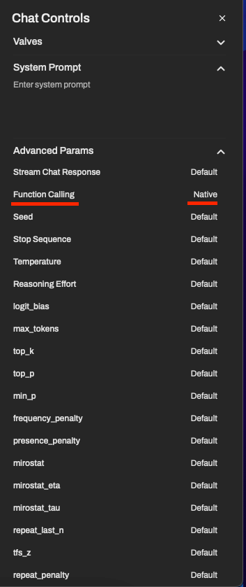
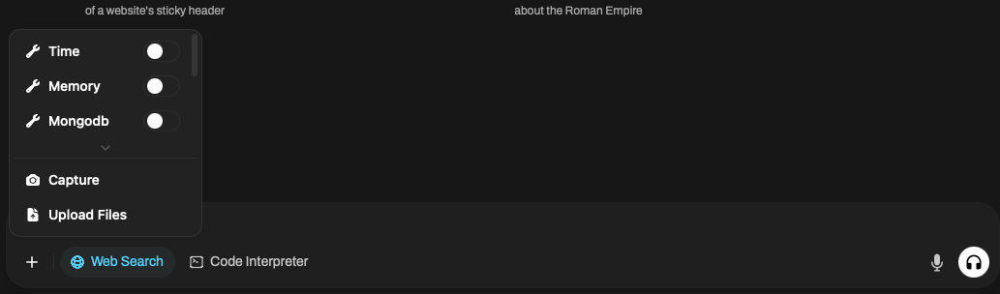

# mcpo
This is a instruction repo for anyone who one to connect their openwebui to mcp server. This is my setup there still a lot of room for improvement so i open for any suggestion. Hope you have a good time with mcp and local AI journey

## MCP-OpenAI proxy
For openwebui, they devlop and proxy so that model can communicate with MCP server. Therefore using a traditional MCP server wont work, we need to put it under a proxy. 

1. Make sure that your openwebui is up to the date or at least above 0.6 to support MCP. Also having ollama run powerful model, (qwen, deepseek) for best possible outcome. I think because this model is more modern so it can utilise these tools.

2. Clone the repo and replace the config.json, currently there is about 7 - 8 difference mcp server. Ideally, you can have how many as you want because inside openwebui, we will give them a unique endpoint based on there name. 

3. Run make a docker, keep in mine that for your extra mcp make sure the version of python is match or it should be compatible otherwise it will failed and remember to install extra package, depency based on your mcp instruction.

4. ideally you want to put the mcpo server and openwebui into 1 machine, i tried to put them seperately but somehow they can not communicate.

5. Login and go to admin panel -> Settings -> Tools -> '+'. And then fill out the ip and the server. it should look something like this

6. For extra, you should enable function calling in the Advanced params

7. You should see this at the chat sidebar

Enjoy and if there is a problem make a issues and i can help you as much as i can.

See ya!
